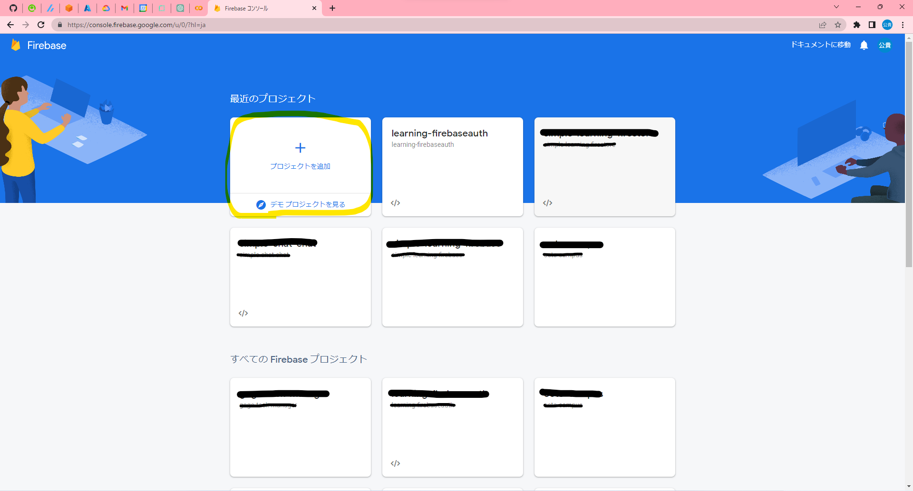
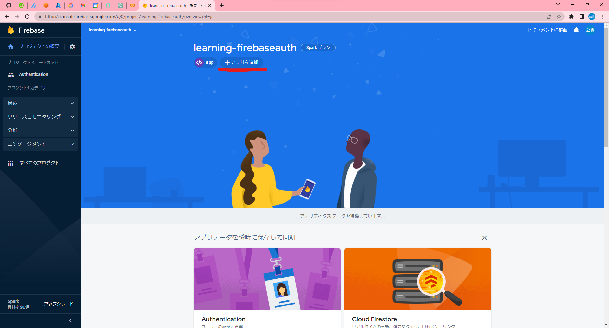
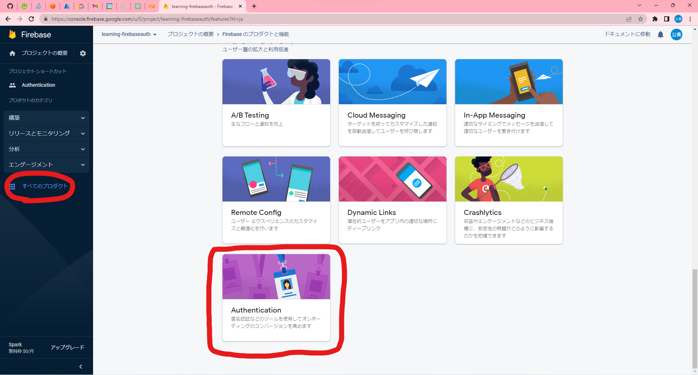
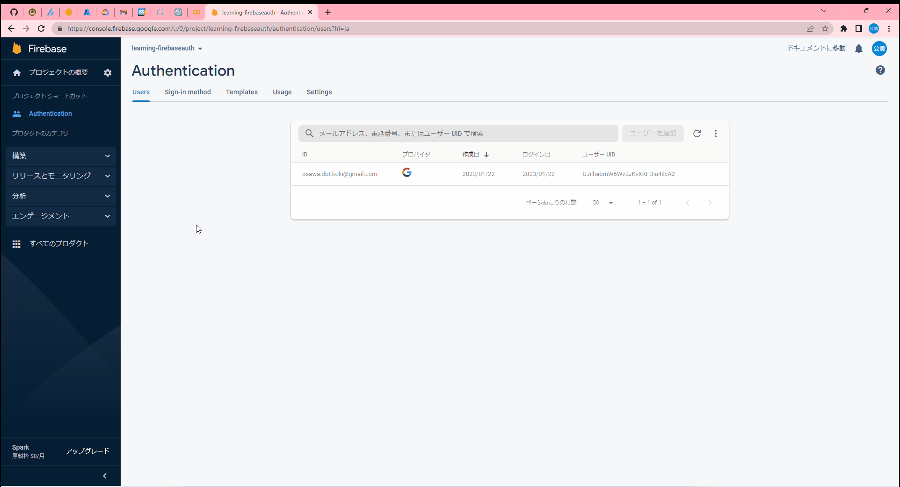
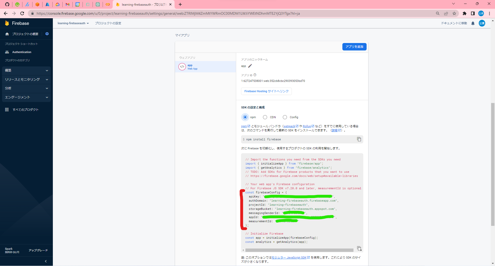
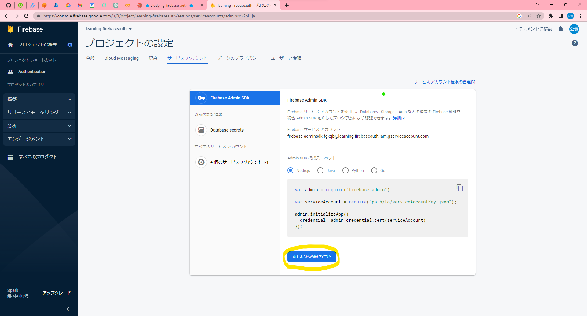
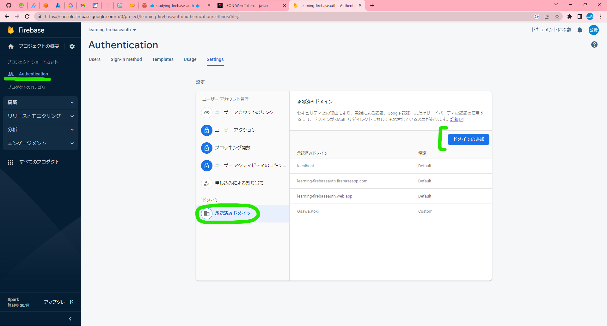

# simple-next-study.ssg.ts

🔐️🔐️🔐️ Firebase Authenticationを使った認証処理のサンプルです。  
簡単に認証処理を実装できます。  

  

## 実行方法

```shell
# モジュールのインストール
yarn

# 開発用実行
yarn dev

# ビルド
yarn build
```

## イロイロ説明

設定方法は以下の手順で。  

1. Firebaseプロジェクトの作成
2. Firebaseアプリの作成
3. Authenticationの有効化
4. 初期化
5. 認証処理の登録
6. サーバサイドでの認証処理

### 1. Firebaseプロジェクトの作成

[Firebaseコンソール](https://console.firebase.google.com/u/0/?hl=ja)からプロジェクトを作成します。  
プロジェクト名は適当でOKです。  

  

### 2. Firebaseアプリの作成

作成したプロジェクトの「アプリ」からアプリを作成します。  
アプリ名は適当でOKです。  

  

### 3. Authenticationの有効化

作成したアプリの「Authentication」から必要な認証方法を有効化します。  
ここではGoogle認証を有効化します。  

  

同時に使用する認証方法を有効化します。  

  

### 4. 初期化

既にコード内に記載済みです。  

```ts
// Firebase Authentication
import firebase from 'firebase/compat/app';
import 'firebase/compat/auth';
import { onAuthStateChanged } from 'firebase/auth';
import firebaseConfig from '../firebaseConfig';
const firebaseApp = firebase.initializeApp(firebaseConfig);
const auth = firebaseApp.auth();
onAuthStateChanged(auth, user => { console.log(user); });

const provider = new firebase.auth.GoogleAuthProvider();
```

最初に`yarn add firebase`でFirebaseをインストールします。  

設定ファイルは`firebaseConfig.ts`として作成します。  
ここにFirebaseアプリ画面から取得した以下のデータを記載します。  

  

### 5. 認証処理の登録

コード内に記載済みです。  
認証後の処理を記載しています。  

```ts
// 認証処理関数
const Auth = () => {
  // signInWithPopup or signInWithRedirect
  // SignInWithPopupはポップアップで認証画面を表示
  // SignInWithRedirectはリダイレクトで認証画面を表示
  firebase.auth().signInWithPopup(provider).then(result => {
    console.log(result);
  }).catch(function(err) {
    console.error(err);
  });
};
```

## 6. サーバサイドでの認証処理

認証処理はクライアントサイドで行いますが、サーバサイドでその認証情報を使用する際には、そのトークンの正当性を検証する必要があります。  
そのためには、Firebaseの管理画面からサービスアカウントキーを取得します。  

  

取得したファイルを保存し、サーバサイドスクリプトで読み込みます。  

```ts
import admin from 'firebase-admin';
import serviceAccount from 'path/to/serviceAccountKey.json';

// Initialize the Firebase Admin SDK with the service account credentials.
admin.initializeApp(serviceAccount as admin.ServiceAccount);
```

この設定を行うことで、サーバサイドでFirebaseの認証情報を使用することができます。  

```ts
// Verify the ID token passed by the client.
const idToken = req.headers.authorization;

// Verify the ID token passed by the client.
admin.auth().verifyIdToken(idToken)
  .then((decodedIdToken) => {
    // The ID token is valid and the claims can be read.
    req.user = decodedIdToken;
    next();
  })
  .catch((error) => {
    // The ID token is invalid or the claims can't be read.
    res.status(401).send({error: 'Unauthorized'});
  });
```

## その他情報共有

### ドメインを追加する

Firebaseの認証画面を表示する際に、ドメインを追加する必要があります。  
Firebaseの管理画面からドメインを追加します。  

  

### 認証後のトークンの内容

認証後のトークンからは以下のプロパティにアクセスできます。  
各プロバイダによって若干異なります。  
これは、Google認証を使用した場合の情報です。  

```ts
{
  name: 'ユーザ名(表示名)',
  picture: '画像パス',
  iss: 'トークンの発行者のURI',
  aud: 'トークンが有効であることが期待されるクライアントの識別子',
  auth_time: 'ユーザが最後にログインした時間',
  user_id: 'ユーザID',
  sub: 'ユーザID(トークンの主題として)',
  iat: トークンが発行された時間,
  exp: トークンの有効期限,
  email: 'メールアドレス',
  email_verified: 'メールアドレスの検証状態',
  firebase: {
    identities: { 'google.com': [Array], email: [Array] },
    sign_in_provider: 'google.com'
  },
  uid: 'UID'
}
```

## あなたがこのプロジェクトをクローンしたらするべきこと

もし、あなたがこのプロジェクトをクローンして使用する場合は、以下の手順を実行してください。  

[イロイロ説明](#イロイロ説明)にしたがって、Firebaseのアプリを作成します。  

このプロジェクトに関して行うべきことは以下の通りです。  

1. Firebaseの管理画面からサービスアカウントキーを取得します。
2. 取得したサービスアカウントキーを`./server/secrets/serviceAccountKey.json`に保存します。
3. Firebaseアプリの設定情報を`./client/firebaseConfig.json`に保存します。

以上です。  

クライアントを実行するには、以下のコマンドを実行します。  

```shell
cd client
yarn && yarn dev
```

サーバを実行するには、以下のコマンドを実行します。  

```shell
cd server
yarn && yarn dev
```

## 参考文献

- [Firebase Authentication](https://firebase.google.com/docs/auth/web/start?hl=ja)
- [Firebase Token](https://firebase.google.com/docs/auth/admin/verify-id-tokens)
